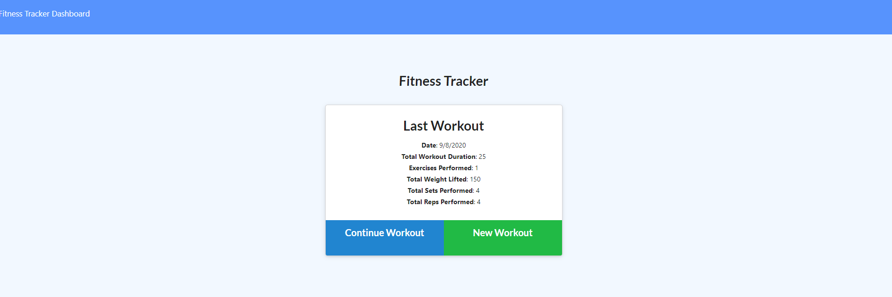
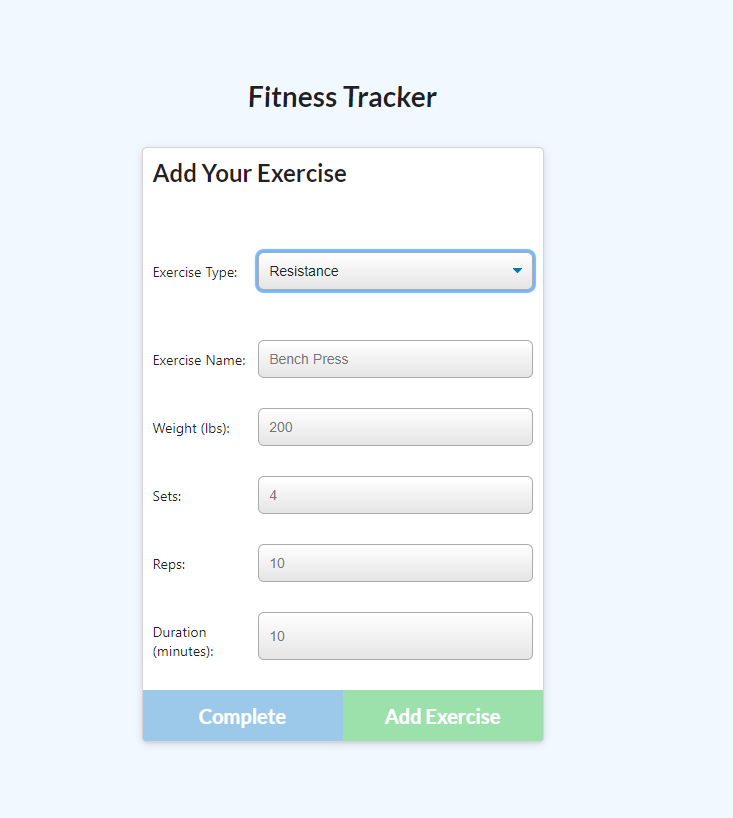
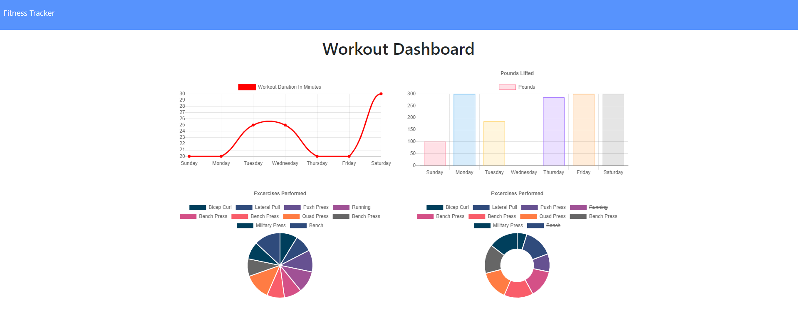

# Fitness Tracker
 

## Description && Deployement
This app allows a user to view, create, and track daily workouts. You can log your exercises including the name, type, duration, weight, reps, and sets and watch your stat data grow into  beautifully designed graphical charts.

You can try the app at [the Fitness Tracker deployed.](./public/assets/images/last-workout.PNG)



---

## Table of Contents
1. [Installation](#Installation)
2. [Usage](#Usage)
3. [License](#license)
4. [Contributing](#Contributing)
5. [Questions](#Questions)
---

## Installation
1. Install Express, Mongoose, and Morgan dependencies.
2. Run the command ``` npm run seed ``` to see import prewritten data to the database. 

## Usage
To run, the user can simply use the command ``` npm start ``` and open their localhost at port 8080.  Once running the app, the user can then log their workout data by clicking "New Workout".  They will be shown a dropdown list for resistance and cardio workouts. Choose one and input your workout data, adding as exercises as needed.

.

When done entering data, the user can then click "Complete" to see their last workout data, or the link to the Dashboard at the top left of the screen to see their data graphed.



---

## License
### ISC License
Copyright (c) 2020 Brianna Bullock

Permission to use, copy, modify, and/or distribute this software for any purpose with or without fee is hereby granted, provided that the above copyright notice and this permission notice appear in all copies.

THE SOFTWARE IS PROVIDED "AS IS" AND THE AUTHOR DISCLAIMS ALL WARRANTIES WITH REGARD TO THIS SOFTWARE INCLUDING ALL IMPLIED WARRANTIES OF MERCHANTABILITY AND FITNESS. IN NO EVENT SHALL THE AUTHOR BE LIABLE FOR ANY SPECIAL, DIRECT, INDIRECT, OR CONSEQUENTIAL DAMAGES OR ANY DAMAGES WHATSOEVER RESULTING FROM LOSS OF USE, DATA OR PROFITS, WHETHER IN AN ACTION OF CONTRACT, NEGLIGENCE OR OTHER TORTIOUS ACTION, ARISING OUT OF OR IN CONNECTION WITH THE USE OR PERFORMANCE OF THIS SOFTWARE. 

---
## Contributing
If a developer would like to contribute, please send me and email at the link below.

---

## Questions

You can visit my [Github Profile](https://www.github.com/kairora) or [this app's Github repo](https://github.com/kairora/fitness-tracker) to learn more about this.
Or, if you have questions regarding this program, please [send me an email](mailto:brianna.bullock16@gmail.com). 